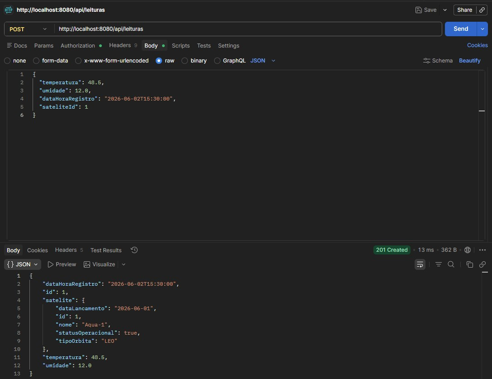
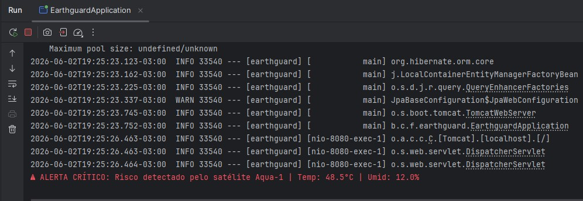
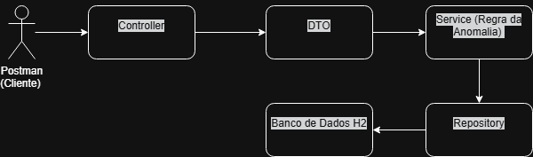

# EarthGuard API 🌍🛰️
**FIAP Global Solution: Space Connect**

## 👨‍💻 Integrantes
* **Enzo Almeida** - RM: 556900
* **Gabriel de Mello** - RM: 554421
* **Gabriel Guilherme** - RM: 558638
* **Guilherme Moreira** - RM: 557290
* **Jose Kretzer** - RM: 555523

---

## 📖 Sobre o Projeto
O **EarthGuard** é uma API RESTful desenvolvida para a Global Solution. O projeto atende ao desafio central de propor soluções que usem tecnologia, dados e inovação para resolver desafios da Terra, ampliando as possibilidades da economia espacial.

O sistema simula a recepção de dados telemétricos de satélites (como temperatura e umidade). Quando os sensores detectam métricas fora do padrão seguro, a API processa a informação e emite alertas críticos automatizados, servindo como uma ferramenta preventiva contra desastres ambientais, como incêndios florestais.

---

## ⚙️ Requisitos Técnicos Aplicados
A arquitetura foi desenhada seguindo as melhores práticas de Engenharia de Software e cobrindo os requisitos da avaliação:

* **Modelagem de Domínio & POO:** Aplicação rigorosa de Orientação a Objetos com a classe abstrata `EquipamentoEspacial`, herança na entidade `Satelite` e polimorfismo nas regras de validação.
* **Abstração e Interfaces:** Desacoplamento garantido através da interface `IMonitoramento`, definindo contratos claros para os equipamentos.
* **Estruturas Auxiliares (DTOs):** Utilização de *Java Records* (`SateliteRequestDTO`, `LeituraSatelitalRequestDTO`) para isolar as entidades do banco de dados das requisições web.
* **Lógica de Fluxo e Datas:** Modularização em camadas (`Controller`, `Service`, `Repository`) e manipulação de histórico de dados utilizando a API `LocalDateTime`.
* **Tratamento de Exceções:** Implementação do `@RestControllerAdvice` para capturar exceções globalmente (ex: `RecursoNaoEncontradoException`), garantindo que o sistema espacial não falhe abruptamente.
* **WebServices e Banco de Dados:** Criação de API REST com Spring Boot e persistência de dados utilizando Spring Data JPA integrado ao banco de dados H2.

---

## 🚀 Tecnologias Utilizadas
* **Java 26**
* **Spring Boot 3** (Web, Data JPA, Validation)
* **H2 Database** (Banco de dados em memória)
* **Lombok** (Redução de boilerplate code)

---

## 🛠️ Como Executar a Aplicação
1. Clone este repositório para a sua máquina local.
2. Abra o projeto na sua IDE (IntelliJ IDEA, Eclipse, VS Code).
3. Aguarde o Maven baixar as dependências (`pom.xml`).
4. Execute a classe principal `EarthguardApplication.java`.
5. A API estará disponível e rodando na porta padrão: `http://localhost:8080`.

---

## 📌 Evidências de Execução

**1. Simulação de Anomalia e Retorno da API (Postman)**

**2. Alerta Crítico Disparado no Sistema (Terminal)**

**3. Diagrama de Fluxos da Aplicação**
